# Introduction to Linux and basic commands

Linux is an open source Unix operating system based on the Linux Kernel, They include Ubuntu,Fedora, Debian, OpenSuse and Red hat. Using Linux for Virtual Private Server is a common pratice.

When operating Linux you need to use shell -a program that gives you ccess to operating system's service.

So if you want learn linux, learning common utilities will go a long way

## What is Linux Commands?

A Linux command is a program or utility that runs on the CLI - A console that that interacts with the same via text and processes. its similar to command prompts Application in the Windows

Linux command are executed in Terminal by pressing "Enter" at the end of the line. You can run command to perform variuos tasks

Here is what a Linux command general syntax looks like: `CommandName [option(s) [parameter(s))]`

A command may contain an option or a parameter. In some cases, it can still run without them. These are the three most command parts of a command:

CommandName is the rule that you want to perform, Operation or flag modifies the command operation, to invoke it, use hypen(-) or double hyphens(--)

# File Manipulation

## 1. sudo command

Short for superuser do, sudo is one of the most popular basic Linux commands that lets you perform task that requires administrative or root permission.

When using sudo the system will prompt users to authenticate themselves with a password.Then Linux system will log a timestamp as a tracker. By default every root user can run sudo command for 15mins/session

If you try to run sudo command in the command line without authenticating the user, the system will log the actiity as a security event

Here is the general syntax
`sudo apt upgrade`

You can also add an "Option", such as

k or -reset- timestamp invalidates the timestamp file

-g or -group = group runs command like a specified group  name or id

-h or host runs comand on the host 
## 2. Pwd

Use the pwd command to find a path  of your present working directory. Simply entering pwd will return the full current path - a path of all directories that start with forward slash(/). For example /home/ubuntu

pwd command uses the syntax below

`pwd [options]`

it has two acceptable options:

-L = -Logical print environment variable content, including symbolic links

-P = - physial prints the actual of the current directory.

Here is the general syntax

`pwd`

## 3. cd command:

To navigate through Linux files and directories use th cd command. Depending on your current working directories, it requires either full path or directory name.

Running this folder without an option will take you to an home folder. Keep in in that only users with sudo privlees can execute it.

If you want to switch, for example home/ubuntu commad Linux/commadlinux

`cd /home/ubuntu/commandslinux`

Here are some shortcut to help you navigate

cd ~ [username] goes to another users directory

cd .. moves one directory up

cd- moves to your previous directory

## 4. ls command

ls command is the list of files and directories within a system. Running it without a flag or parameter will show current working directory's content.

To see other directories content, type "ls" followed by the desired path. for example to view files in document directories.
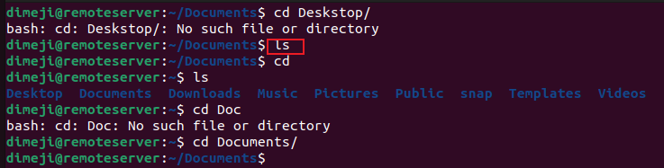
Here are some options you can use with ls tool:

`ls -R` List all fine within subdirectories

`ls -a` Shows hidden files, in addition to the visible ones

`ls -lh` shows the file size in readable format, such as MB, GB and TB

## 5. cat command

 Conacetate or cat is the most used linux commands. its lists, combine and writes file content to the standard output. To run the cat command, type cat followed by the file name and its extension. For instance

`cat tutorial`

 

 ## 6. cp command

 Use the cp command to copy files or directories and their content, Take a look at the following use cases

 To copy files from a directory to another, enter cp followed by filename and the destination directory. For example

 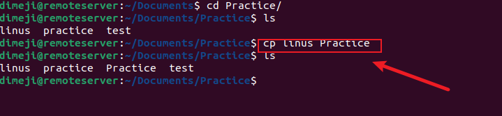

 ## 7. mv command

"mv" command is primarily used to move and rename files and directories. It does not produce an output after execution

## 8. mkdir command

mkdir command is used to create one or multiple file at once and set permissions for each of them

## 9. rmdir command

Used rmdir command to remove and empty directories, permanently

`rmdir`

10. rm command

"rm" command is used to delete file in a directories.

Always remember that this process can not be undone

`rm filename`

## 11. touch  command

"touch" command is used to create a new file

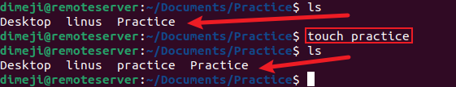

## 12. locate command

locate command can be used to find a file in the system database.

Moreover adding argument -i, case sensitivity will be turned of for easier seacrh

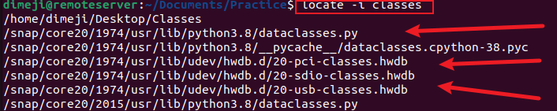

## 13. find command

"find" command is used to search for a file within a specific directory and perform subsequent operations.

## 14. grep command

its a basic linux command, it is "global regular expression print. It helps you search a word within a file in a specific dirctory.

Once grep command find match, it prints all line that contain specific pattern. The command helps filter through large log files

The command output will display lines that contain blue.

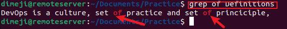

## 15. df command

Use thr df command to report the system' disk usage, shown in percentage and kilobyte(KB). Here is the general syntax.

`df -h`

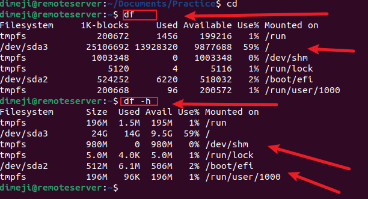

## 16. du command 

Used when you want to know the space a directory or a file takes up. You can run this command to know which part of your system uses storage excessively 

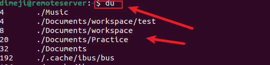

## 17. head command

The "head" command allows you to veiw th first 10 lines of a text. Adding an options lets you change the number of lines shown.

Here is the general syntax

`head [options] [file]

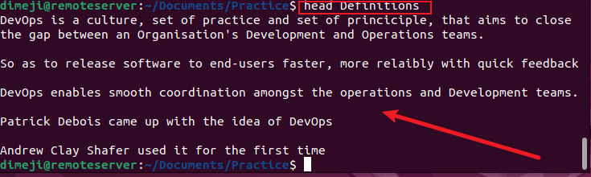

## 18. tail command

The "tail" command displays the last ten lines of a file. it allows you to know whether has new data or read error messages

`tail[option] [file]`

## 19. diff command

Sort for different, compares two content of a file line by line. after analysing them, it will display part that do not match.

Programmer often used the diff command to altar a program instead of rewriting the entire source code.

Here are the syntax

`diff [option][file1][file2]`

## 20. tar command

The "tar" command archives multiple files into tar. file, Its a common Linux format similar to zip, with optional compression

Here are the basic syntax

`tar [options]{archive_file 1][file]`

# File Permission and Ownership

## 21. chmod command

chmod is a common command that modifies a file or directory's read, write, and execute permission. In Linux each file is associated with three users classes, owner, group member and others.

Here is the basic syntax.

`chmod[option][permission][filename]`

## 22. chown command

The chown command lets you change ownership of a file, directory or a symbolic link to a specified usersname

Here is the basic syntax

`chown [option] owner[:group] file(s)`

## 23. Job command

A job is a process that the shell start , the job command command will display all the running process along with their statuses. Remember that this command is only available in csh, bash, tcsh, ksh shells

Here are the basic syntax

`job [options] jobID`

## 24. kill command

Use the kill command to terminate unresponsive programme manually. it will signal misbehaving  application and instruct them to close their process

To Kill a programme you must know the process identification number, (PID) , If you dont know the PID, run the following command:

`ps -ux`

After knowning the signal used, and the program PID. Enter the following syntax

`kill {signal_option}pid`

## 25. ping command

ping command is one of the most used basic Linux command for checking whether a network of server is reachable. In addition it is used to troubleshoot connectivity issues.

`ping [options] [hostname or IP address]`

## 26. wget

This Linux command lets you download files from the internet using the wget command, it works in the background without hindering other running processes.

To use this command, follow this

`wget [options] [url]`

## 27. uname

The uname or unix name command will print a detail informtion about your Linux system and hardware. This include machine name, operating system and kernel.

To run this command, simply enter your uname to CLI.

Here is the Basic Sytax

`uname [options]`

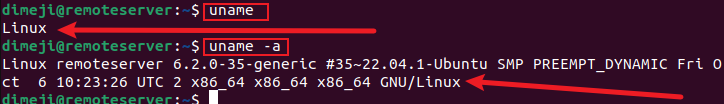

## 28. top command 

The top command in Linux will display all running processes and dynamic realtime veiw of the current system. it sums up the resource  utilisation, from CPU to memory usage.

The top command can also let you identify and terminate a process, that may use many system resources.

To run the command, simply enter top to the CLI

`top`

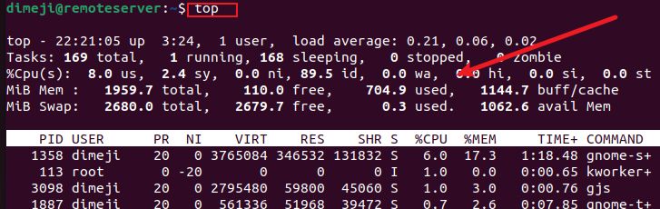

## 29. history command

With history the system will list up to 500 previously executed command, allowing you to reuse them without re entering them. Keeping in mind only users with sudo privileges can execute this command. how this utility runs is determined by the kind of linux shell you use.

To run it, enter the command below

`history [option]`

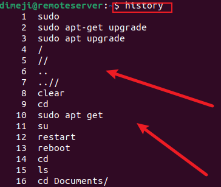

## 30. man command

The man provides user manual of any command or utilities you can use on the terminal, including the name, description and options.

It consists of nine sections

Here is the basic syntax below

`man [command_name]`

## 31. echo

The echo command is a built utility that dislay the lines of text and strings using the standard output.

Here is the basic syntax

`echo [option][strings]`

## 32. zip, unzip command

Use the zip command to compress your file, into a zip file, a universal format commonly used on Linux. It can  automatically choose the best compression ratio.
The zip command is also useful for archiving file and directories and reducing the disk usage.

`zip [options][zipfile] file1 file2`

## 33. hostname command

Run hostname command for the system's hostname, you can execute it with or without an option.

Here is the general syntax

`hostname[options]`

There are many options to use including:

-a or -alias, displays the hostname alias or -A which displays the machine fully qualified domain name(FQDN), -ip which displays the IP address of the machine

## 34. useradd, userdel command

Linux is a multi user system, meaning more than one person can use it simultaenously, useradd is used to create a new account while the passwd command allows you to add password. only those with sudo privileges can run useradd command

When you use useradd command, it performs some major changes.

Edits the /etc/passwd,/etc/shadow,/etc/group, files for the newly created accounts. Creates and populate new home directoriesfor the user. Set files permission and ownerships to the home directories.
Here are the basic syntax

`useradd [options] username`

To set the password,

`passwd the_password_combination`

For example to add new person named "john", here are the following steps:

`useradd john`

`passwd 1234567`

To delete a user account, use the userdel commansd:

`userdel username`

## 35. apt-get command

It is a command line tool used for handling Advanced packaged tool (APT) libraries in the Linux. It lets you retrieve informayion and bundles from authenticated sources to manage, update, remove and install softwares and its dependencies.

Running apt-get command rquires you to use sudo or root privileges.

Here are the main syntax:

`apt-get [options] (command)`

Most common command that can be added to apt-get are;

-update sychronises the package files from their sources
-upgrade install the latest versrion of all installed packages, check updates the package cache, and check broken dependencies.

## 36. nano, vi, jed commands

LINUX allows user edit and manage files via text editor such as nano, vi or jed. nano and vi comes with the operating system but jed has to be installed.

nano commands denote keywords ans can work with most languages, To use it enter the following command

`nano [filename]`

vi uses two operating modes to work - insert and command, insert is sed to edit and create text file, on the other hand command performs operations such s svaing, opening, copying and pasting a file

To use vi on a file, enter

`vi [filenamw]`

 

