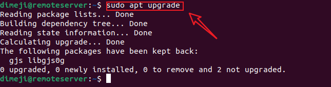
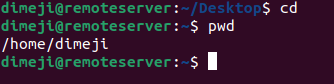
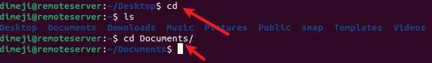

# Introduction to Linux and basic commands

Linux is an open source Unix operating system based on the Linux Kernel, They include Ubuntu,Fedora, Debian, OpenSuse and Red hat. Using Linux for Virtual Private Server is a common pratice.

When operating Linux you need to use shell -a program that gives you ccess to operating system's service.

So if you want learn linux, learning common utilities will go a long way

## What is Linux Commands?

A Linux command is a program or utility that runs on the CLI - A console that that interacts with the same via text and processes. its similar to command prompts Application in the Windows

Linux command are executed in Terminal by pressing "Enter" at the end of the line. You can run command to perform variuos tasks

Here is what a Linux command general syntax looks like: `CommandName [option(s) [parameter(s))]`

A command may contain an option or a parameter. In some cases, it can still run without them. These are the three most command parts of a command:

CommandName is the rule that you want to perform, Operation or flag modifies the command operation, to invoke it, use hypen(-) or double hyphens(--)

# File Manipulation

## 1. sudo command

Short for superuser do, sudo is one of the most popular basic Linux commands that lets you perform task that requires administrative or root permission.

When using sudo the system will prompt users to authenticate themselves with a password.Then Linux system will log a timestamp as a tracker. By default every root user can run sudo command for 15mins/session

If you try to run sudo command in the command line without authenticating the user, the system will log the actiity as a security event

Here is the general syntax
`sudo apt upgrade`

You can also add an "Option", such as

k or -reset- timestamp invalidates the timestamp file

-g or -group = group runs command like a specified group  name or id

-h or host runs comand on the host 
## Pwd

Use the pwd command to find a path  of your present working directory. Simply entering pwd will return the full current path - a path of all directories that start with forward slash(/). For example /home/ubuntu

pwd command uses the syntax below

`pwd [options]`

it has two acceptable options:

-L = -Logical print environment variable content, including symbolic links

-P = - physial prints the actual of the current directory.

Here is the general syntax

`pwd`

## cd command:

To navigate through Linux files and directories use th cd command. Depending on your current working directories, it requires either full path or directory name.

Running this folder without an option will take you to an home folder. Keep in in that only users with sudo privlees can execute it.

If you want to switch, for example home/ubuntu commad Linux/commadlinux

`cd /home/ubuntu/commandslinux`

Here are some shortcut to help you navigate

cd ~ [username] goes to another users directory

cd .. moves one directory up

cd- moves to your previous directory

